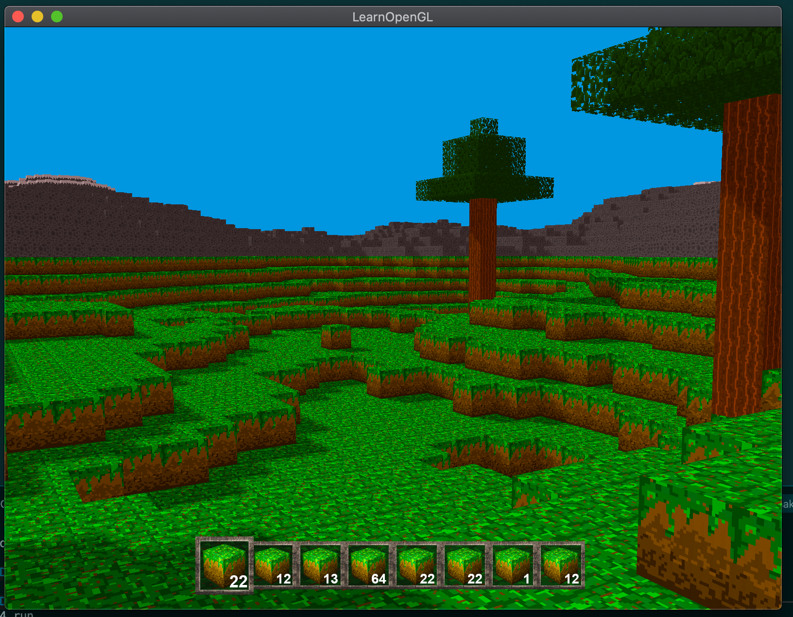

# OpenGL-project
Just a simple Minecraft-like game built using OpenGL 3.3, glad, glfw3 and glm.

So far I have included:
- Random terrain generation
- Shadow generation with two different shadow maps to increase the resolution for nearby objects
- Basic collision detection system using cuboids as hitboxes and only comparing the vertices to detect intersections.
- Simple ray casting to identify the closest filled block that the player is pointing at.
- Inventory bar
- Game engine handling collisons, entities and items

Feel free to use the code and resources in this repository as you want.

Any comments on the approaches used to solve the problems tackled would be appreciated

\- David del Val
